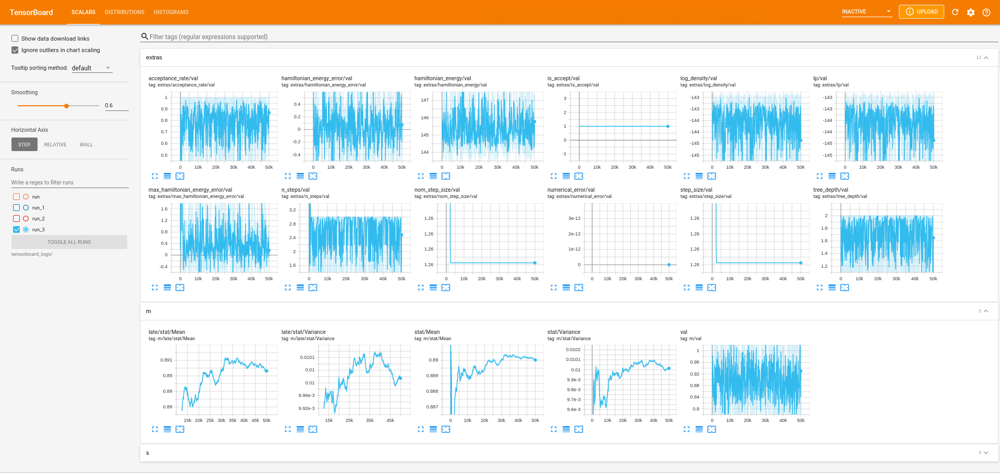

```@meta
CurrentModule = TuringCallbacks
DocTestSetup  = quote
    using TuringCallbacks
end
```

# TuringCallbacks

```@contents
```

## Getting started
As the package is not yet officially released, the package has to be added from the GitHub repository:
```@example
julia> ]
pkg> add https://github.com/torfjelde/TuringCallbacks.jl
```

## Visualizing sampling on-the-fly
`TensorBoardCallback` is a wrapper around `TensorBoardLogger.TBLogger` which can be used to create a `callback` compatible with `Turing.sample`.

To actually visualize the results of the logging, you need to have installed `tensorboad` in Python. If you do not have `tensorboard` installed,
it should hopefully be sufficient to just run
```sh
pip3 install tensorboard
```
Then you can start up the `TensorBoard`:
```sh
python3 -m tensorboard.main --logdir tensorboard_logs/run
```
Now we're ready to actually write some Julia code.

The following snippet demonstrates the usage of `TensorBoardCallback` on a simple model. 
This will write a set of statistics at each iteration to an event-file compatible with Tensorboard:

```julia
using Turing, TuringCallbacks

@model function demo(x)
    s ~ InverseGamma(2, 3)
    m ~ Normal(0, √s)
    for i in eachindex(x)
        x[i] ~ Normal(m, √s)
    end
end

xs = randn(100) .+ 1;
model = demo(xs);

# Number of MCMC samples/steps
num_samples = 50_000

# Sampling algorithm to use
alg = NUTS(0.65)

# Create the callback
callback = TensorBoardCallback("tensorboard_logs/run", num_samples)

# Sample
chain = sample(model, alg, num_samples; callback = callback)
```

While this is sampling, you can head right over to `localhost:6006` in your web browser and you should be seeing some plots!



In particular, note the "Distributions" tab in the above picture. Clicking this, you should see something similar to:


And finally, the "Histogram" tab shows a slighly more visually pleasing version of the marginal distributions:


Note that the names of the stats following a naming `$variable_name/...` where `$variable_name` refers to name of the variable in the model.
For more information about what the different stats represent, see [`TensorBoardCallback`](@ref).

## Types & Functions

```@autodocs
Modules = [TuringCallbacks]
Private = false
Order = [:type, :function]
```

## Internals
```@autodocs
Modules = [TuringCallbacks]
Private = true
Public = false
```

## Index

```@index
```
